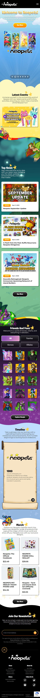
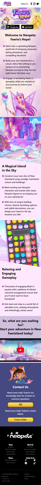
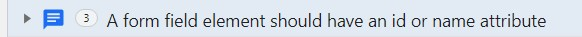
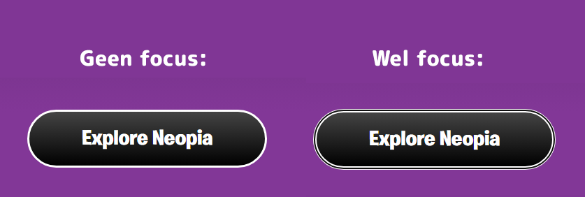
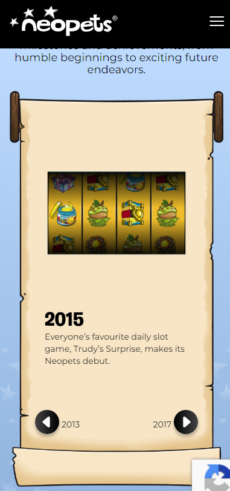
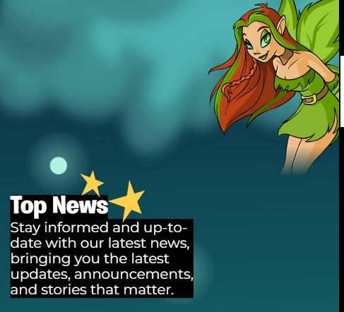
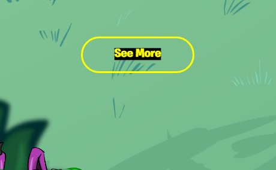
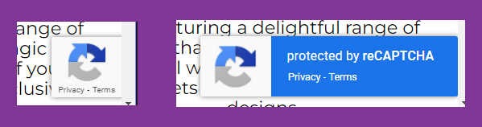

# Procesverslag
Markdown is een simpele manier om HTML te schrijven.  
Markdown cheat cheet: [Hulp bij het schrijven van Markdown](https://github.com/adam-p/markdown-here/wiki/Markdown-Cheatsheet).

Nb. De standaardstructuur en de spartaanse opmaak van de README.md zijn helemaal prima. Het gaat om de inhoud van je procesverslag. Besteedt de tijd voor pracht en praal aan je website.

Nb. Door *open* toe te voegen aan een *details* element kun je deze standaard open zetten. Fijn om dat steeds voor de relevante stuk(ken) te doen.

## Jij

  
uitwerken voor kick-off werkgroep

  ### Auteur:
  Kim van Aken

  #### Je startniveau:
  Blauw
  #### Je focus:
  Surface plane 

## Je website

  
uitwerken voor kick-off werkgroep

  ### Je opdracht:
  [Neopets](https://neopets.com/)
  #### Screenshot(s) van de eerste pagina (small screen): 
  Homepage  
  

  #### Screenshot(s) van de tweede pagina (small screen):
  Pagina 2  
  
 

## Toegankelijkheidstest 1/2 (week 1)

  
uitwerken na test in 2e werkgroep

  ### Test 1: Voice Over Bevindingen:
  Lijst met je bevindingen die in de test naar voren kwamen:
 - Hij begint met het voorlezen van de header links.
 - Bij het deel over Friends en Foes loops hij vast. (Ik kan niet makkelijk door alle personage's heen scrollen.)
 - Omdat sommige objecten worden weergegeven met een link en een plaatje, wordt de link twee kee opgelezen ondanks dat het de link voor hetzelfde is.
 - Bij het zijwaartse scrolldeel geeft de narrator alleen "link" aan.
 - De H en D knoppen doen niets bij de homepage. H hoort ervoor te zorgen dat je naar de volgende header kan, en de D hoort naar de volgende "Landmark" of "Container" te gaan, dat gebeurt niet op de pagina.
  ### Test 2: WCAG Checklist Bevindingen:
  Gevonden fouten:
  
  - Content:
  Geen fouten.
  - Global code:
  Geen, de enige gevonden error is het volgende:
    
  - Keyboard
  Er is een focus stijl, maar die kan iets beter geimplementeerd worden.
  Sommige elementen worden overgeslagen bij keyboard focus.
  Zie bijvoorbeeld de button focus:
  
  - Mobile and touch
  De scrollbook section op de pagina is een beetje vervormt en erg lang op mobile.
    
  - Headings
   Geen fouten.
  - Lists:
    Geen fouten.
  - Images:
    De alt van de images is vaak niet specifiek genoeg. Als er een karakter is die "Walter" heet, is de alt text gewoon "Walter". Mensen die neit kunnen zien weten niet hoe Walter er uitziet.
  - Media:
    De carrousels op de pagina kunnen niet op pauze.
  - Controls:
  Links die in broodtekst staan kunnen duidelijker worden aangegeven.
    Buttons zijn a'tjes met een button class, i.p.v. een button.
  - Appearance:
    Dark mode is niet supported.
    Hoog contrast mode is aanwezig, maar kan beter geimplementeerd worden, zie het volgende:
    
     
  - Animation:
    De animaties zijn subtiel, maar dueren zoms erg lang, elementen die "inschuiven" schuiven ook weer langzaam weg als je wegscrollt, misschien beter om te laten staan?
  - Color contrast:
    Geen fouten.

  ### Kleurenblindheid bevindingen:
  - Blue Cone Monochramacy / Achromatomaly:
    Geen problemen met het gebruik van de website
  - Monochramacy / Achromatopsia:
  Ook geen problemen, het contrast van de plaatjes en knoppen is goed genoeg om te zien wat er gebeurt. 
  - Green-Weak / Deuteranamaloy:
    Geen opmerkingen
  - Green-blind / Deuteranopia:
  Geen opmerkingen
  - Red-weak / Protanomaly:
   Geen opmerkingen
  - Red-blind / Protanopia:
    Geen opmerkingen
  - Blue-weak / Tritanomaly:
    Geen opmerkingen
  - Blue-blind / Tritanopia:
    Geen opmerkingen.
  
  Bij het gebruik van de website heb ik geen momenten gevonden waar kleurenblindheid de effectiviteit van de website tegenhoudt. 

  ### Andere opmerkingen:
  De captcha button zit voor elke elementen. Dit is vooral erg irritant op Mobile.
    
  Sommige secties van de website laden erg sloom. (Bijv de scroll / book section)

## Breakdownschets (week 1)

  
uitwerken na afloop 3e werkgroep

  ### de hele pagina: 
  

  ### dynamisch deel (bijv menu): 
  

  ### wellicht nog een dynamisch deel (bijv filter): 
  

## Voortgang 1 (week 2)

  
uitwerken voor 1e voortgang

  ### Stand van zaken
  hier dit ging goed & dit was lastig (neem ook screenshots op van delen van je website en code)

  ### Agenda voor meeting
  samen met je groepje opstellen

  | student 1      | student 2          | student 3    | student 4        |
  | ---            | ---                | ---          | ---              |
  | dit bespreken  | en dit             | en ik dit    | en dan ik dat    |
  | en dat ook nog | dit als er tijd is | nog een punt | dit wil ik zeker |
  | ...            | ...                | ...          | ...              |

  ### Verslag van meeting
  hier na afloop snel de uitkomsten van de meeting vastleggen

  - punt 1
  - punt 2
  - nog een punt
  - ...

## Voortgang 2 (week 3)

  
uitwerken voor 2e voortgang

  ### Stand van zaken
  hier dit ging goed & dit was lastig (neem ook screenshots op van delen van je website en code)

  ### Agenda voor meeting
  samen met je groepje opstellen

  | student 1      | student 2          | student 3    | student 4        |
  | ---            | ---                | ---          | ---              |
  | dit bespreken  | en dit             | en ik dit    | en dan ik dat    |
  | en dat ook nog | dit als er tijd is | nog een punt | dit wil ik zeker |
  | ...            | ...                | ...          | ...              |

  ### Verslag van meeting
  hier na afloop snel de uitkomsten van de meeting vastleggen

  - punt 1
  - punt 2
  - nog een punt
- ...

## Toegankelijkheidstest 2/2 (week 4)

  
uitwerken na test in 9e werkgroep

  ### Bevindingen
  Lijst met je bevindingen die in de test naar voren kwamen (geef ook aan wat er verbeterd is):

## Voortgang 3 (week 4)

  
uitwerken voor 3e voortgang

  ### Stand van zaken
  hier dit ging goed & dit was lastig (neem ook screenshots op van delen van je website en code)

  ### Agenda voor meeting
  samen met je groepje opstellen

  | student 1      | student 2          | student 3    | student 4        |
  | ---            | ---                | ---          | ---              |
  | dit bespreken  | en dit             | en ik dit    | en dan ik dat    |
  | en dat ook nog | dit als er tijd is | nog een punt | dit wil ik zeker |
  | ...            | ...                | ...          | ...              |

  ### Verslag van meeting
  hier na afloop snel de uitkomsten van de meeting vastleggen

  - punt 1
  - punt 2
  - nog een punt
  - ...

## Eindgesprek (week 5)

  
uitwerken voor eindgesprek

  ### Je uitkomst - karakteristiek screenshots:
  

  ### Dit ging goed/Heb ik geleerd: 
  Korte omschrijving met plaatjes

  

  ### Dit was lastig/Is niet gelukt:
  Korte omschrijving met plaatjes

  

## Bronnenlijst

  
continu bijhouden terwijl je werkt

  Nb. Wees specifiek ('css-tricks' als bron is bijv. niet specifiek genoeg). 
  Nb. ChatGpT en andere AI horen er ook bij.
  Nb. Vermeld de bronnen ook in je code.

  1. bron 1
  2. bron 2
  3. ...

